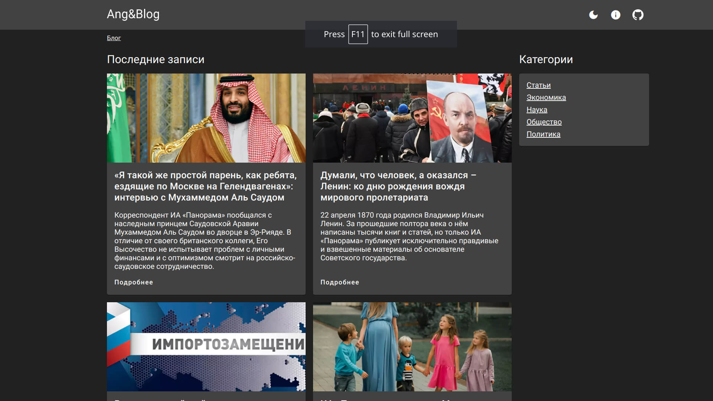

# Angular Blog

An example of a static blog on [Angular](https://angular.io/) and [Contentful](https://www.contentful.com/).



Contentful for Angular is a regular API that is no different from any other API. Angulars task in this case is to get the data from the API and display it. 

To give Angular SSG properties, a small script was written that receives data from Contentful and generated static pages.

Demo can be viewed here - [angular-blog.fafn.ru](https://angular-blog.fafn.ru).


## Installation

First, you should install vendors:

```bash
yarn
```

After installing the dependencies, the hooks will create the necessary files to run the application. You can run the command yourself:

```bash
yarn env
```

As a result, files will be created:

- apps/blog/.env - Application environments;
- apps/blog/src/app/routes/blog.routes.ts - Generated routes for blog;
- libs/ui/categories/src/lib/categories.ts - Generated categories for blog;
- apps/blog/dynamic-routes.txt - All paths to be passed to the prerender;

## Setup Contentful

For Contentful to work, you need to provide a key and your namespace in apps/blog/.env:

```text
NX_CONTENTFUL_KEY=your-key
NX_CONTENTFUL_SPACE=your-space
```

If you don't have accounts, you can generate mock data:

```bash
yarn mocks
```

## Start the app

To start the development server run `nx serve blog`. Open your browser and navigate to http://localhost:4200.


## Running tasks

For load data and generate blog use command:

```
yarn load
```

For build application with prerender call command:

```
yarn prerender
```

For start server: 

```
node dist/apps/blog/server/ru/main.js
```

Targets can be defined in the `package.json`.


## Contact me

- [Habr](https://habr.com/ru/users/fafnur)
- [Medium](https://medium.com/@fafnur)
- [Fafn.ru](https://fafn.ru)
